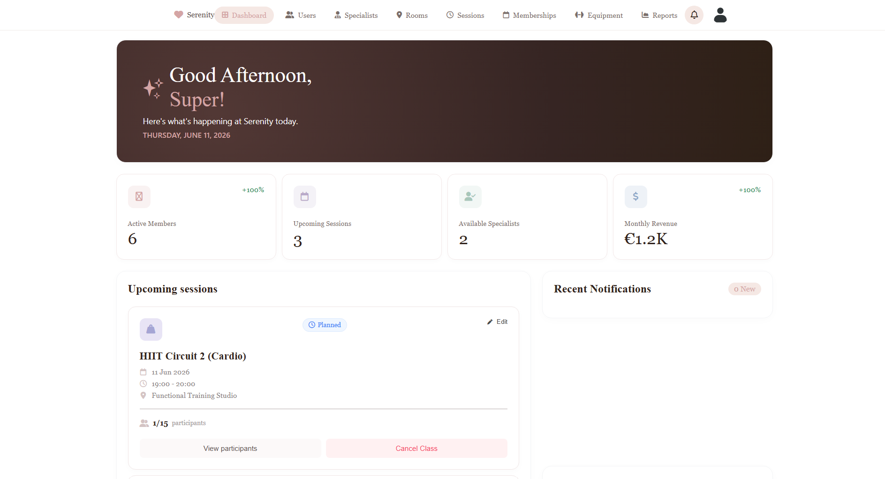
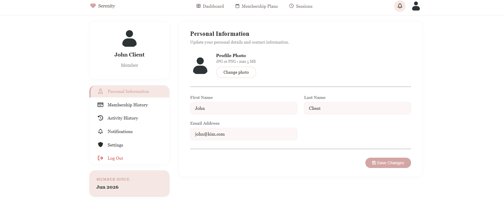
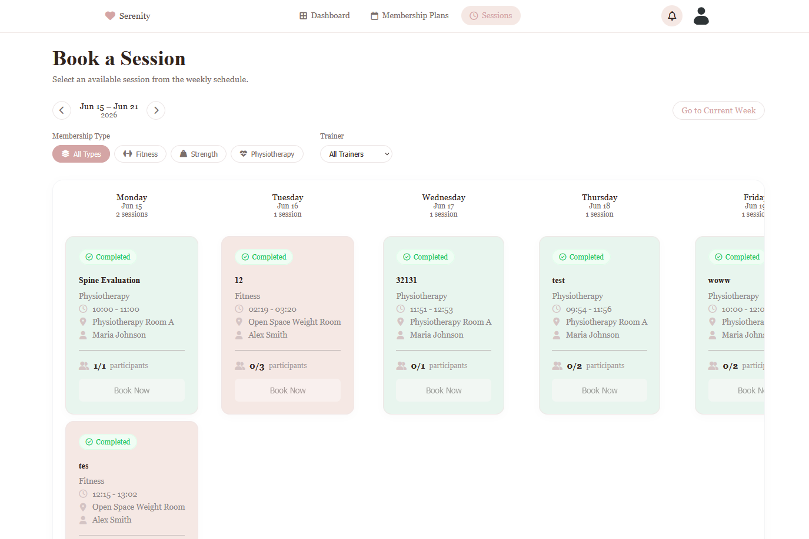
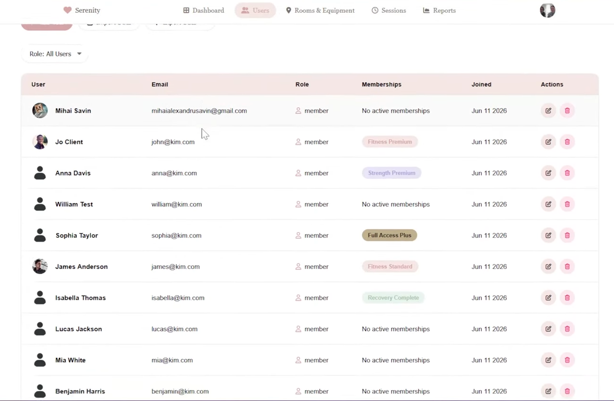
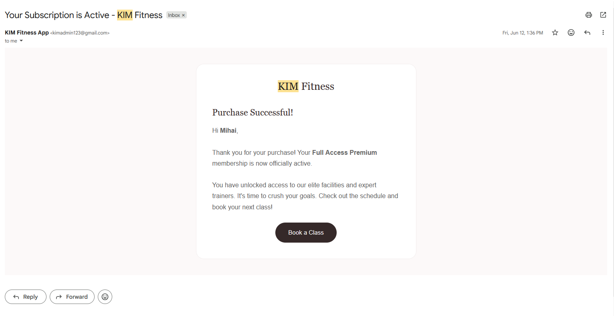
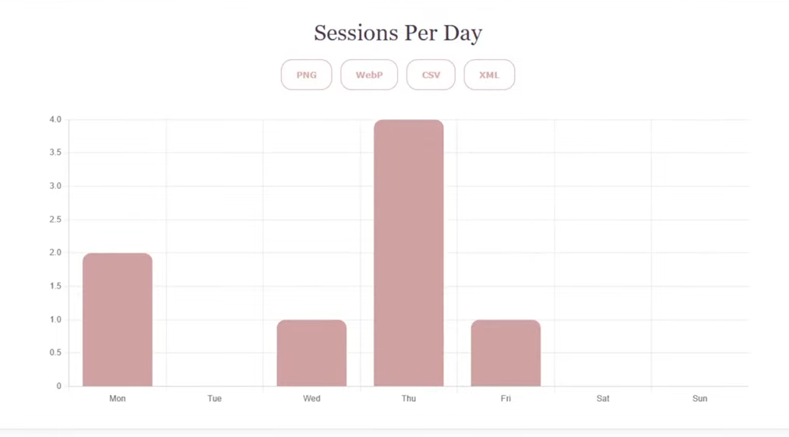
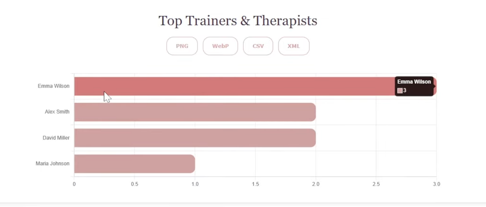
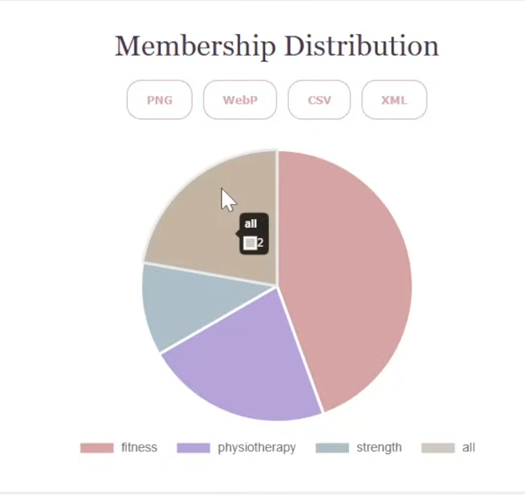

# KIM - Kineto Web Manager

KIM is a modular web application designed to manage the activities of a fitness, strength, and physiotherapy center. The platform centralizes the management of users, subscriptions, sessions, trainers, rooms, and statistical reports.

## Architecture & Design

The application is built on the MVC+S (Model-View-Controller and Services) architecture, ensuring a clear separation between the user interface, business logic, and data access. 

## Core Functionalities

### User Management
* Register and authenticate users.
* Manage three distinct roles: administrator, trainer/therapist, and member.
* Update personal information and profile pictures.
* View activity history, future sessions, and temporarily suspend subscriptions based on associated rules.

### Session & Booking Management
* View the complete schedule of available sessions.
* Administrators and trainers can create, modify, or cancel sessions.
* Configure sessions by assigning a responsible trainer and room.
* Members can book available spots and cancel existing reservations.
* Manage maximum capacity and prevent scheduling conflicts.

### Subscription Management
* Access three main categories: Fitness, Strength, and Physiotherapy, each with multiple variations based on included sessions and price.
* Purchase subscriptions directly within the platform.
* Automatically calculate validity periods, available sessions, and handle automatic expiration.

### Trainer & Room Management
* Manage trainer/therapist profiles and their specializations (fitness, strength, physiotherapy).
* Create, modify, activate, or deactivate rooms and manage their maximum capacities.
* Manage equipment associated with each room.
* Import and export trainer data in CSV and XML formats.

### Reports & Notifications
* Generate statistics on active users, session bookings, and trainer rankings.
* Analyze subscription distribution and export reports in CSV, XML, PNG, and WebP formats.
* Send visual in-app notifications and email alerts for booking confirmations, schedule changes, and administrative messages.


## Screenshots

<table>
  <tr>
    <td align="center">
      <strong>Main Home Page</strong><br>
      
    </td>
    <td align="center">
      <strong>Admin Dashboard</strong><br>
      
    </td>
  </tr>
  <tr>
    <td align="center">
      <strong>Account Page</strong><br>
      
    </td>
    <td align="center">
      <strong>Book Sessions Page</strong><br>
      
    </td>
  </tr>
  <tr>
    <td align="center">
      <strong>Manage Users Page</strong><br>
      
    </td>
    <td align="center">
      <strong>Sample Mail</strong><br>
      
    </td>
  </tr>
</table>

**Admin Graphs**
<table>
  <tr>
    <td align="center">
      <strong>Sessions</strong><br>
      
    </td>
    <td align="center">
      <strong>Trainers</strong><br>
      
    </td>
    <td align="center">
      <strong>Memberships</strong><br>
      
    </td>
  </tr>
</table>

## User Roles

| Role | Permissions |
| :--- | :--- |
| **Administrator** | Manages users, trainers, and rooms; creates/modifies/cancels any session; handles CSV/XML data imports/exports; generates statistical reports and charts. |
| **Trainer/Therapist** | Creates, modifies, and cancels their own specialized sessions; views personal schedules and session participants; updates personal profile. |
| **Member** | Purchases subscriptions; books and cancels session spots; views activity history and upcoming schedule; suspends subscriptions; receives email/in-app notifications. |

## Database Structure

* **USERS**: User information and roles.
* **TRAINERS**: Specific data for trainers and therapists.
* **SUBSCRIPTIONS & SUBSCRIPTION_FEATURES**: Available packages and their associated benefits.
* **USER_SUBSCRIPTIONS**: Packages purchased by users.
* **ROOMS & EQUIPMENT**: Available activity spaces and their associated gear.
* **SESSIONS & BOOKINGS**: Organized classes and user reservations.
* **NOTIFICATIONS**: Alerts sent to users.

## Tech Stack
PHP, MySQL, HTML, CSS, JavaScript, Chart.js, PHPMailer, XAMPP.

## Installation (XAMPP)

1. Clone or copy the project into your `C:\xampp\htdocs\` directory. The folder must be named exactly `kim` for internal routing to function properly.
2. Start the **Apache** and **MySQL** modules from the XAMPP Control Panel.
3. Navigate to `http://localhost/phpmyadmin`, create a database named `kim_db`, and import the provided SQL script to build the tables and seed data.
4. Create a `.env` file in the project root folder and configure your database and email credentials:
   ```env
   # Database Configuration
   DB_HOST="localhost"
   DB_NAME="kim_db"
   DB_USER="root"
   DB_PASS=""

   # App URL
   APP_URL="http://localhost/kim"

   # Mailtrap Configuration (Testing)
   MAILTRAP_USER="your_mailtrap_user"
   MAILTRAP_PASS="your_mailtrap_password"

   # Real SMTP Configuration (Production)
   SMTP_USER="your_email@gmail.com"
   SMTP_PASS="your_app_password"

   # Toggle between mock mail (true) and real mail (false)
   MOCK_MAIL="true"
   ```
5. Access the application at [http://localhost/kim](http://localhost/kim).